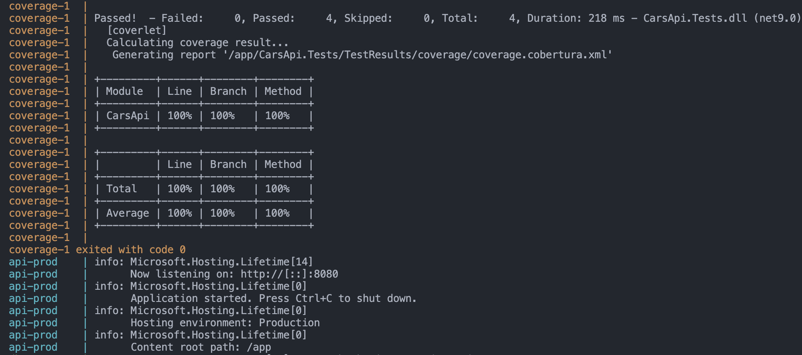

# 🚗 Backend - Cars API

Este proyecto es una **API REST en C# con ASP.NET Core** que permite consultar marcas de autos almacenadas en una base de datos PostgreSQL. Está desarrollado con buenas prácticas de arquitectura, pruebas automatizadas y un flujo de despliegue similar al de un entorno real.

---

## 📦 Arquitectura general

- La API expone un endpoint para consultar todas las marcas de autos.
- Las migraciones y el seed de datos se gestionan desde un contenedor independiente, simulando el comportamiento de pipelines en entornos reales.
- Las pruebas unitarias tienen una cobertura del 100% y se ejecutan de forma automática dentro de su propio contenedor, deteniendo el proceso si alguna falla.

---

## ▶️ Ejecución del entorno

Para levandar el entorno se usa el comando:

`docker compose up`

Al iniciar el entorno, se levantan tres contenedores:

- **api-prod**: servicio principal de la API REST
- **db**: base de datos PostgreSQL
- **tests**: ejecuta las pruebas unitarias automáticamente

  

---

## 🛠️ Migraciones y seed de datos

La ejecusion de la migracion se hace con el comando:

`docker compose up migrate`

Una vez que el backend se encuentra corriendo y escuchando en el puerto correspondiente, se ejecuta un contenedor aparte llamado `migrate`, que:

- Instala `dotnet-ef`
- Aplica la migración `InitialCreate`
- Carga datos semilla en la tabla `AutoBrands`

Este enfoque hace énfasis en la separación de responsabilidades, alineado con las buenas prácticas de despliegue, donde las migraciones se ejecutan como pasos independientes y no dentro del ciclo de vida de la aplicación.

---

## 📎 Endpoint disponible

Una vez el backend está en ejecución, la documentación Swagger UI está disponible en:

[http://localhost:8080/swagger](http://localhost:8080/swagger)

---
