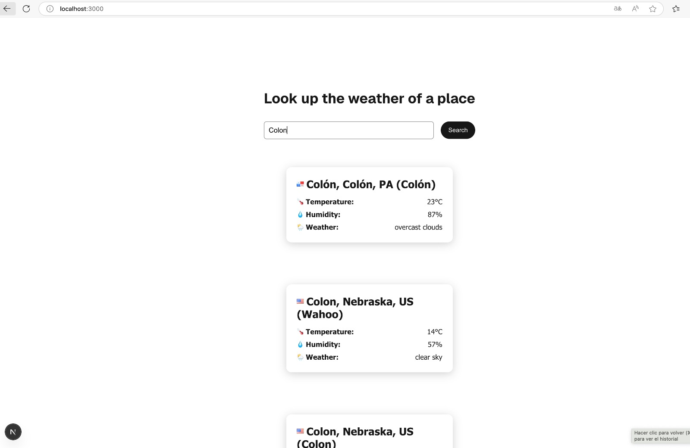
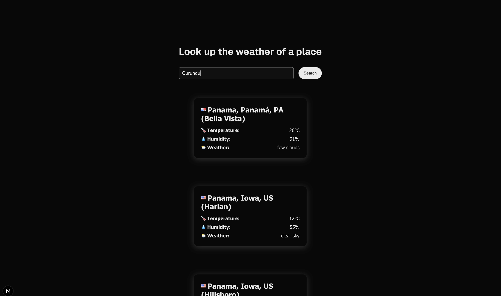

# 🖥️ Frontend - Places Weather App

Este proyecto utiliza **Next.js (App Router)** con TypeScript y estilos mediante CSS Modules.  
Además, cuenta con una suite de pruebas automatizadas escritas con **Jest** y **React Testing Library**.

### 🌗 Modos claro y oscuro

  
  

### 🔗 APIs utilizadas

Se integraron **dos endpoints** distintos de la API de OpenWeatherMap:

1. **Geocoding API**  
   Permite buscar ciudades a partir del texto ingresado por el usuario. Devuelve una lista de ubicaciones coincidentes con su latitud y longitud.

2. **Current Weather API**  
   A partir de las coordenadas obtenidas, consulta el clima actual de cada ubicación (temperatura, humedad, descripción).

### 🎨 Otras características

- Soporte para modo **claro y oscuro** automático (basado en `prefers-color-scheme`)
- Estilo visual limpio y moderno
- Tipado completo con TypeScript
- Separación por responsabilidades y estructura escalable

### ▶️ Ejecución del frontend

Para iniciar el frontend en modo producción se debe ejecutar el siguiente comando

`docker compose up front-service-prod`

Este comando realizará lo siguiente:

- Ejecutará los tests automatizados con Jest para validar el estado del proyecto.
- Si los tests pasan correctamente, levantará la aplicación en modo producción.
- La aplicación estará disponible en:  
  [http://localhost:3000](http://localhost:3000)
